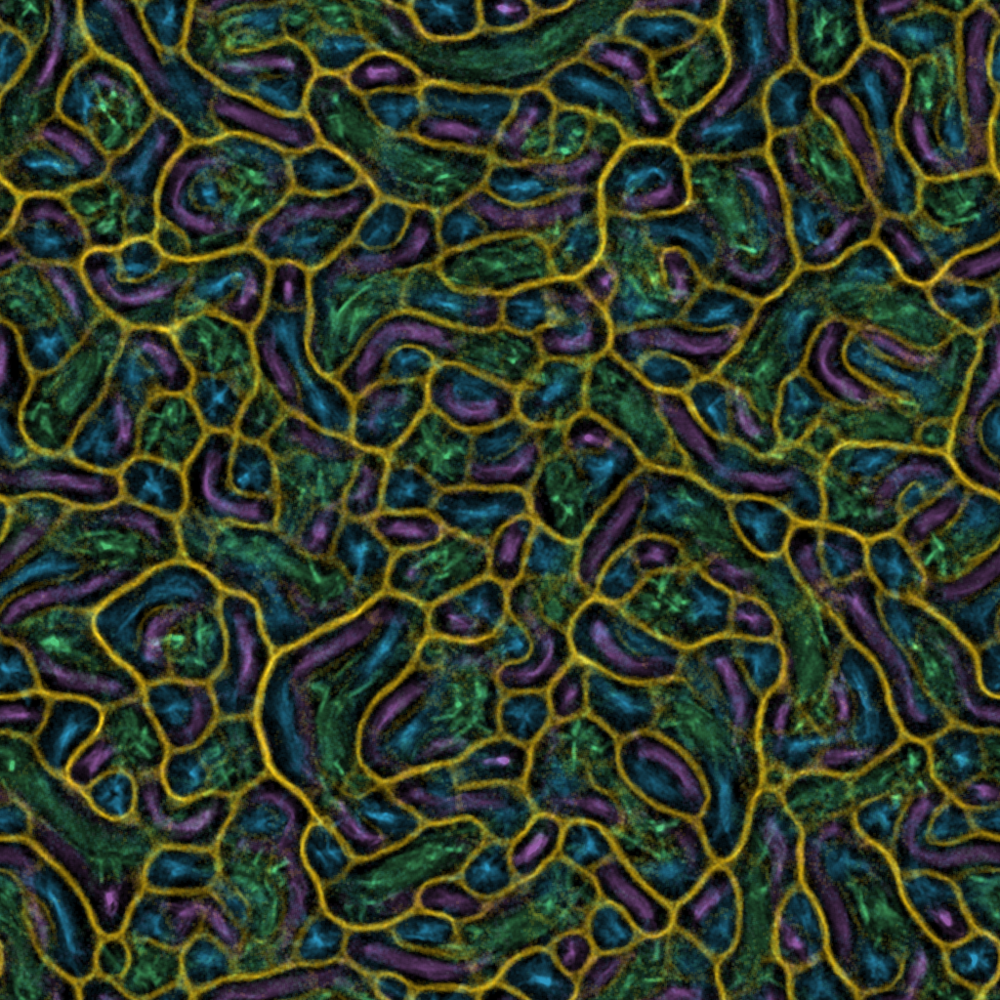

I recently came across [this repo](https://github.com/fogleman/physarum) that uses Go to implement an extended version of the Physarum transport networks model, first described in:

> Jones, J. (2010). Characteristics of pattern formation and evolution in approximations of physarum transport networks. Artificial Life, 16(2), 127-153. https://doi.org/10.1162/artl.2010.16.2.16202

I was amazed by the images this model produces, so I decided to figure out how it works and reimplement it in Rust for no other reason than to have some fun and practice some Rust.

# Physarum Simulation

The simulation consists of a 2D grid that stores information about the spatial distribution of some chemotactic sensory stimuli. This is called the _trail_ layer in the original paper. The stimuli attract discrete agents that are meant to represent a particle of Physarum plasmodium gel-sol structure. Each agent knows its position and orientation on the said 2D grid. They are attracted to the stimuli. They have sensors to tell them which way they should turn and move to reach the location with the highest level of the thing that attracts them. As the agents move, they leave a trail of the same stimuli behind, effectively signaling other agents where they should follow. The trail layer is also subjected to a simple diffusion-decay operator after every agent got their change to move to a new location. This image (shamelessly taken from [here](https://sagejenson.com/physarum)) shows all the steps that happen during one iteration of the simulation:

